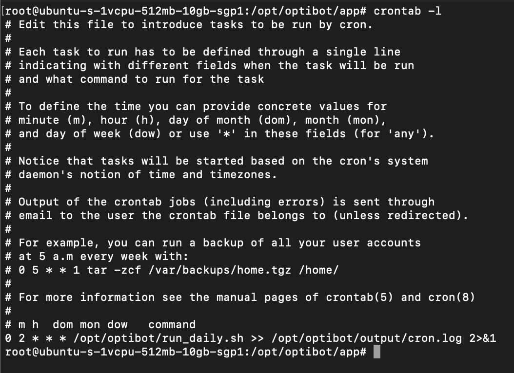
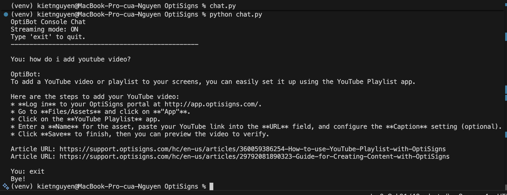

# OptiBot Mini-Clone

A small scraper-uploader job that ingests OptiSigns support articles, converts them into clean Markdown, and syncs only new or updated documents to Gemini File Search Store for retrieval-based customer support answers.

## What it does

- Scrapes support articles from `support.optisigns.com`
- Converts article HTML into clean Markdown files
- Stores each article with title, source URL, updated time, and `Article URL:` citation line
- Detects `added`, `updated`, and `skipped` articles using content hashes
- Uploads only new or updated Markdown files to Gemini File Search Store
- Writes the latest run summary to `output/last_run.json`

## Tech stack

- Python 3.11
- Docker
- Gemini API / Gemini File Search Store
- BeautifulSoup
- markdownify
- python-dotenv

## Environment variables

Create a `.env` file from `.env.sample`:

```env
GEMINI_API_KEY=your_gemini_api_key_here
GEMINI_FILE_SEARCH_STORE_NAME=fileSearchStores/your_store_name_here
GEMINI_MODEL=your_selected_model
```

## Run locally

Install dependencies:

```bash
python3 -m venv venv
source venv/bin/activate
pip install -r requirements.txt
```

Run the job:

```bash
python main.py
```

The job will create/update:

```txt
output/data/articles/
output/state/articles.json
output/last_run.json
```

## Run with Docker

Build the image:

```bash
docker build --no-cache -t optibot-job .
```

Run the job with persistent output:

```bash
mkdir -p output

docker run --rm \
  --name optibot-daily-job \
  --env-file .env \
  -v "$(pwd)/output:/app/output" \
  optibot-job
```

The mounted `output/` folder keeps article Markdown files, state, and last run logs between runs.

## Daily job deployment

The job can be scheduled on a DigitalOcean Droplet using cron. In my deployment, cron calls a small wrapper script at `/opt/optibot/run_daily.sh`, and that script runs the Docker job while appending logs to `output/cron.log`.

Example cron command:

```cron
0 2 * * * /opt/optibot/run_daily.sh >> /opt/optibot/output/cron.log 2>&1
```

This runs once per day at 2:00 AM server time.

Cron entry on the server:



Example job output after a scheduled run:


The `run_at` field in the log is stored in UTC format. For example, `2026-07-04T19:00:20.824770+00:00` is equivalent to `02:00:20` in Vietnam time (`UTC+07:00`) on July 5, 2026, which matches the cron schedule configured for `2:00 AM`.

Last run artifact:

```txt
/opt/optibot/output/last_run.json
```

Job log:

```txt
/opt/optibot/output/cron.log
```

## Chunking strategy

Each support article is saved as one clean Markdown file with metadata and an `Article URL:` line near the top. The Markdown files are uploaded programmatically to Gemini File Search Store, where Gemini handles chunking, embedding, and indexing. Keeping the source URL inside each document helps retrieved chunks preserve citation information. If manual chunking were needed, I would split by Markdown headings with a target size of around 800-1,200 tokens and keep 100-150 tokens of overlap.

## Sample question

Test question:

```txt
How do I add a YouTube video?
```

Expected behavior:

- The assistant answers only from the uploaded support docs
- The answer is concise and factual
- The answer includes up to 3 `Article URL:` citation lines

Example console result:


